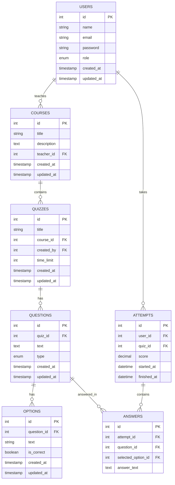

This is a [Next.js](https://nextjs.org) project bootstrapped with [`create-next-app`](https://nextjs.org/docs/app/api-reference/cli/create-next-app).

## Getting Started

First, run the development server:

```bash
npm run dev
# or
yarn dev
# or
pnpm dev
# or
bun dev
```

Open [http://localhost:3000](http://localhost:3000) with your browser to see the result.

You can start editing the page by modifying `app/page.tsx`. The page auto-updates as you edit the file.

This project uses [`next/font`](https://nextjs.org/docs/app/building-your-application/optimizing/fonts) to automatically optimize and load [Geist](https://vercel.com/font), a new font family for Vercel.

## Learn More

To learn more about Next.js, take a look at the following resources:

- [Next.js Documentation](https://nextjs.org/docs) - learn about Next.js features and API.
- [Learn Next.js](https://nextjs.org/learn) - an interactive Next.js tutorial.

You can check out [the Next.js GitHub repository](https://github.com/vercel/next.js) - your feedback and contributions are welcome!

## Deploy on Vercel




{
  "name": "Super Admin",
  "email": "admin@quizmaster.com",
  "password": "$2a$12$Yq9k5vV5Kz6f7g8h9j0k1u2l3m4n5o6p7q8r9s0t1u2v3w4x5y6z7", // This is bcrypt hash for password "admin123"
  "role": "admin",
  "isValidated": true,
  "adSkipping": true,
  "createdAt": { "$date": "2025-12-30T00:00:00Z" }
}

import clientPromise from '@/lib/mongodb';
import { NextResponse } from 'next/server';

// Test if the route is reachable
export async function GET(request: Request) {
  console.log("=== GET /api/teacher/classes called ===");
  
  try {
    const client = await clientPromise;
    console.log("MongoDB client connected successfully");
    
    const db = client.db('online-quizzes');
    console.log("Using database:", db.databaseName);
    
    // List collections to debug
    const collections = await db.listCollections().toArray();
    console.log("Available collections:", collections.map(c => c.name));
    
    const classes = await db.collection('classes')
      .find({ teacherId: "test-teacher-123" })
      .sort({ createdAt: -1 })
      .toArray();

    console.log("Found classes:", classes.length);
    
    return NextResponse.json({ 
      success: true,
      classes: classes.map(c => ({
        _id: c._id.toString(),
        name: c.name,
        code: c.code,
        type: c.type,
        students: c.students?.length || 0,
        inviteLink: c.inviteLink || `/join/class/${c.code}`,
      }))
    });
    
  } catch (error) {
    console.error("=== GET ERROR ===");
    console.error("Error:", error);
    console.error("Error stack:", error instanceof Error ? error.stack : 'No stack');
    
    return NextResponse.json({ 
      success: false,
      message: "Failed to fetch classes",
      error: error instanceof Error ? error.message : 'Unknown error',
      details: process.env.NODE_ENV === 'development' ? error instanceof Error ? error.stack : null : undefined
    }, { status: 500 });
  }
}

export async function POST(request: Request) {
  console.log("=== POST /api/teacher/classes called ===");
  
  try {
    // Parse request body
    let body;
    try {
      body = await request.json();
      console.log("Request body parsed successfully:", body);
    } catch (parseError) {
      console.error("Failed to parse request body:", parseError);
      return NextResponse.json({
        success: false,
        message: "Invalid request body. Expected JSON.",
        error: parseError instanceof Error ? parseError.message : 'Unknown parse error'
      }, { status: 400 });
    }

    // Validate required fields
    if (!body.name || !body.code) {
      console.log("Missing required fields:", { name: body.name, code: body.code });
      return NextResponse.json({ 
        success: false,
        message: "Missing required fields: name and code are required",
        received: body
      }, { status: 400 });
    }

    // Connect to database
    const client = await clientPromise;
    console.log("MongoDB client connected");
    
    const db = client.db('online-quizzes');
    console.log("Using database:", db.databaseName);

    // Check if class code already exists
    const existingClass = await db.collection('classes').findOne({ 
      code: body.code.toUpperCase().trim() 
    });
    
    if (existingClass) {
      console.log("Class code already exists:", body.code);
      return NextResponse.json({ 
        success: false,
        message: "Class code already exists. Please use a different code." 
      }, { status: 409 });
    }

    // Create class document
    const classData = {
      name: body.name.trim(),
      code: body.code.toUpperCase().trim(),
      type: body.type || "public",
      teacherId: "test-teacher-123", // TODO: Replace with real auth
      students: [],
      inviteLink: body.type === 'private' 
        ? `/join/class/${body.code.toUpperCase()}/invite`
        : `/join/class/${body.code.toUpperCase()}`,
      createdAt: new Date(),
      updatedAt: new Date(),
    };

    console.log("Creating class with data:", classData);

    const result = await db.collection('classes').insertOne(classData);
    console.log("Insert result:", result);

    // Fetch the created class
    const createdClass = await db.collection('classes').findOne({ 
      _id: result.insertedId 
    });

    console.log("Created class:", createdClass);

    return NextResponse.json({ 
      success: true,
      message: "Class created successfully",
      class: {
        _id: createdClass?._id.toString(),
        name: createdClass?.name,
        code: createdClass?.code,
        type: createdClass?.type,
        students: createdClass?.students?.length || 0,
        inviteLink: createdClass?.inviteLink,
      }
    }, { status: 201 });

  } catch (error) {
    console.error("=== POST ERROR ===");
    console.error("Full error:", error);
    
    // Check if it's a MongoDB connection error
    if (error instanceof Error && error.message.includes('ECONNREFUSED')) {
      console.error("MongoDB connection refused. Is MongoDB running?");
    }
    
    return NextResponse.json({ 
      success: false,
      message: "Failed to create class",
      error: error instanceof Error ? error.message : 'Unknown error',
      details: process.env.NODE_ENV === 'development' ? error instanceof Error ? error.stack : null : undefined
    }, { status: 500 });
  }
}

export async function DELETE(request: Request) {
  try {
    const { searchParams } = new URL(request.url);
    const id = searchParams.get("id");
    
    console.log("=== DELETE /api/teacher/classes called ===");
    console.log("Deleting class with ID:", id);
    
    if (!id) {
      return NextResponse.json({ 
        success: false,
        message: "Class ID required" 
      }, { status: 400 });
    }

    const client = await clientPromise;
    const db = client.db('online-quizzes');

    const { ObjectId } = await import('mongodb');
    
    const result = await db.collection('classes').deleteOne({ 
      _id: new ObjectId(id),
      teacherId: "test-teacher-123"
    });

    console.log("Delete result:", result);

    if (result.deletedCount === 0) {
      return NextResponse.json({ 
        success: false,
        message: "Class not found" 
      }, { status: 404 });
    }

    return NextResponse.json({ 
      success: true,
      message: "Class deleted successfully" 
    });
    
  } catch (error) {
    console.error("=== DELETE ERROR ===");
    console.error("Error deleting class:", error);
    
    return NextResponse.json({ 
      success: false,
      message: "Failed to delete class",
      error: error instanceof Error ? error.message : 'Unknown error'
    }, { status: 500 });
  }
}